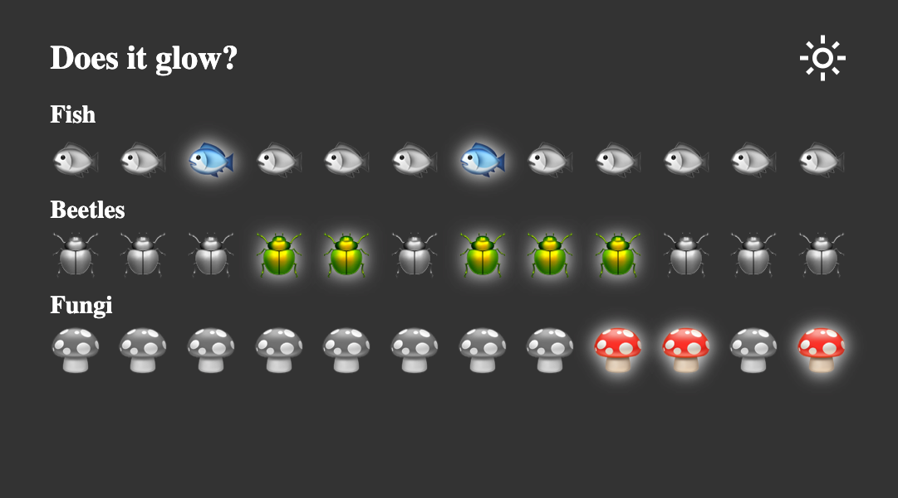

# Does It Glow?

One very common use case for **context** is theming! If your app lets a user change its
appearance (e.g. dark mode), that theme information can be kept in context so that
components anywhere can quickly access it to adjust their visual appearance.

This is a _pair-programming_ exercise, so designate one person in your group to be the
initial Driver.

## Create and provide theme context

In a new file named `ThemeContext.jsx`:

1. Create a new context named `ThemeContext`.
2. Export `ThemeProvider`, which provides three values to its children:
   - `isDark` is a boolean state variable with an initial value of `false`
   - `theme` is `"dark"` if it `isDark`; otherwise it is `"light"`
   - `toggleTheme` is a function that sets `isDark` to the opposite value when called
3. Export a custom hook named `useTheme`, which subscribes to `ThemeContext` if possible.
   It throws an Error if called outside `ThemeProvider` (i.e. `useContext` returns null).
4. Provide the newly created context to your app by wrapping it with `<ThemeProvider/>` in
   `main.jsx`.
5. Use the [React Developer Tools](https://react.dev/learn/react-developer-tools) to
   confirm that `isDark`, `theme`, and `toggleTheme` are correctly provided to your `App`
   by checking the `Context.Provider` component in the **Components** tab.

Once you've confirmed that the correct context values are being provided,
designate a new person to be the Driver and continue to the next section.

## Consume theme context

Now you can use your custom `useTheme` hook to access context variables from anywhere in
your app! No more prop drilling!

6. In `<App>`, set the class of the outermost `
` to `theme`.
7. In `<Navbar>`, the button should toggle the theme when clicked.
8. In `<Navbar>`, the text of the button should be `light_mode` if the theme is dark, and
   `dark_mode` if the theme is light.
9. In `<Specimen>`, give the `<li>` an additional `glow` class if and only if the theme is
   dark and the specimen should glow.

At this point, you should have a fully working application that is able to toggle between
light and dark themes with the click of a button!

> [!NOTE]
>
> The icons are generated through a clever technique involving font ligatures!
> This is accomplished using the [Google Icon Font](https://fonts.google.com/icons).
